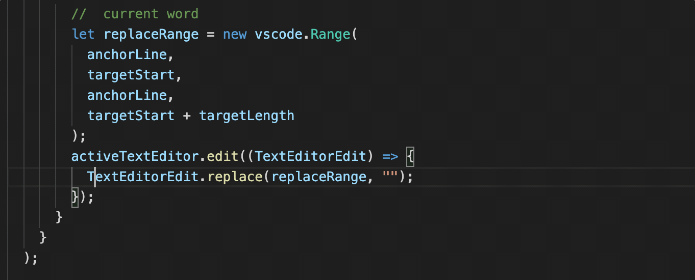

# Delete Here

## Features

You can move the cursor to target word,and delete the word with <kbd>Alt(Option)+D</kbd>

## Extension Settings

if you are using another extension which is already take  the <kbd>Alt(Option)+D</kbd> Key, you can modify the hotkey in your hotkey settings panel by <kbd>Ctrl(Cmd)+K</kbd>+<kbd>Ctrl(Cmd)+S</kbd>  ,and search **Delete here** to set another hotkey.

## Known Issues

No issue for now

## Release Notes

### 0.0.1

see source code on [github repo](https://github.com/Zippowxk/Deletehere)

